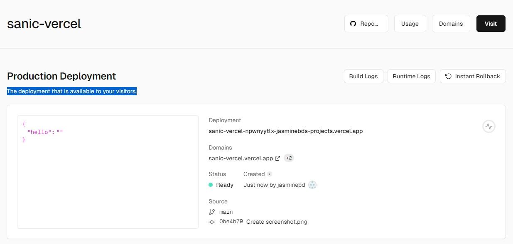

# Vercel of Sanic

> 官方文档:  [Vercel](https://vercel.com/docs/functions/runtimes/python#asynchronous-server-gateway-interface) | [Sanic](https://sanic.dev/en)


## Deploy

### 使用 Vercel 进行部署

[](https://vercel.com/import/project?template=https://github.com/jasminebd/sanic-vercel)

### sanic.app.Sanic 实例

```python
#api/index.py
from sanic import Sanic
from sanic.response import json
app = Sanic("app")

@app.route('/')
@app.route('/<path:path>')
async def index(request, path=""):
    return json({'hello': path})
```


